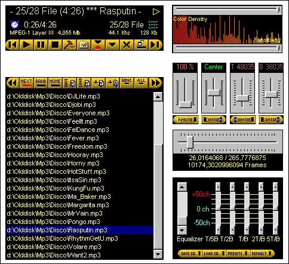



## Rasputin Player

### Description

So, yet another Player from Greece with many feautures. It has everything (basic track and playlist handling,equalizer, VU meter, System tray mode and other stuff) except Id3 Tag handling (almost ready for my next submission) and skins. I've never added skins or stuff like that but it works pretty well (and this is the most important thing). Some of it's code was taken from various places on the internet so thank everybody for helping. Please rate me (it means a great deal to me) whether if it is a bad or a good rate number.
 
### More Info
 
Uses MUCH of the computers resources :(

             |
---                |---
**Submitted On**   |2001-03-30 01:24:16
**By**             |[Zozas Ioannis](https://github.com/Planet-Source-Code/PSCIndex/blob/master/ByAuthor/zozas-ioannis.md)
**Level**          |Intermediate
**User Rating**    |4.1 (33 globes from 8 users)
**Compatibility**  |VB 5\.0, VB 6\.0
**Category**       |[Sound/MP3](https://github.com/Planet-Source-Code/PSCIndex/blob/master/ByCategory/sound-mp3__1-45.md)
**World**          |[Visual Basic](https://github.com/Planet-Source-Code/PSCIndex/blob/master/ByWorld/visual-basic.md)
**Archive File**   |[Rasputin P187084222001\.zip](https://github.com/Planet-Source-Code/zozas-ioannis-rasputin-player__1-22583/archive/master.zip)

### API Declarations

Many

